# Creating your first Lambda

## Setting up the Lambda

So our first step will be to go into the console and call up the Lambda that we want to set up. Do a search in the console main page for the word "Lambda. That should take you to a page that looks like this:

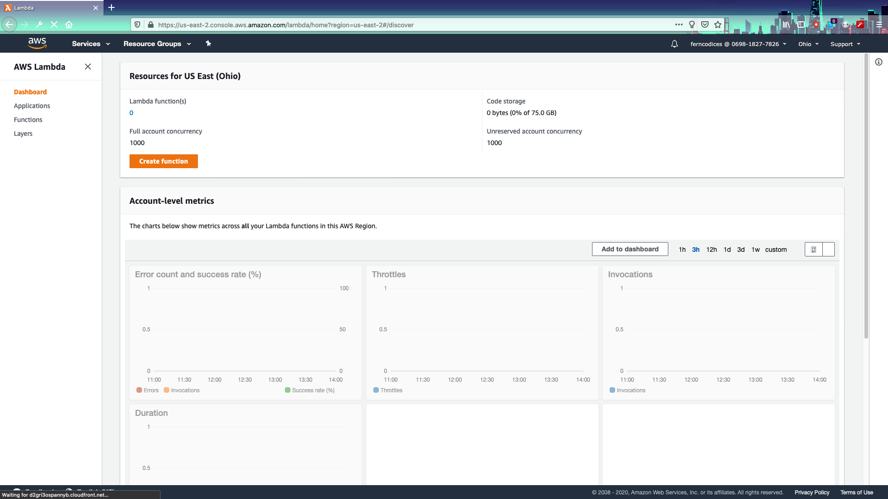

The instructor will go through each of the charts and what they mean later. For now let's choose "CREATE FUNCTION" and get started on the setup!

Select the following:

* Author from scratch
* Basic Information = "myFirstAPI"
* Runtime: Node.js 12.X
* Permissions (leave as is)
* Click "CREATE function"

You should now see something that looks like this:

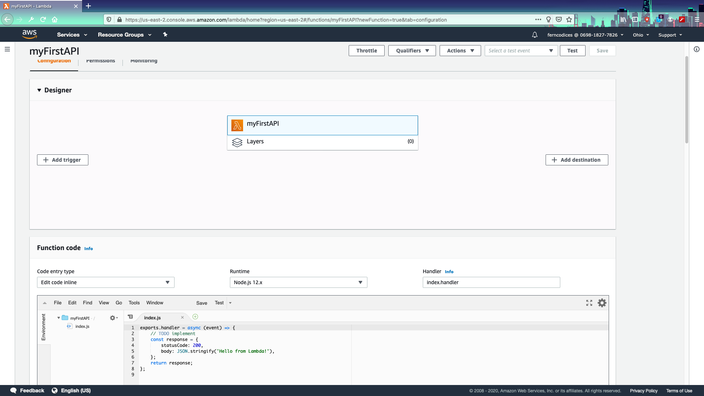

Scroll down and you should see an INLINE CODE section.

Change the messaging in the body of the response there to whatever you want. In our case let's do a classic:

```
exports.handler = async (event) => {
    // TODO implement
    console.log("HEY I GOT THIS EVENT! ", event)
    const response = {
        statusCode: 200,
        body: JSON.stringify('Oh Hai Mark!'),
    };
    return response;
};
```

* Click **SAVE**

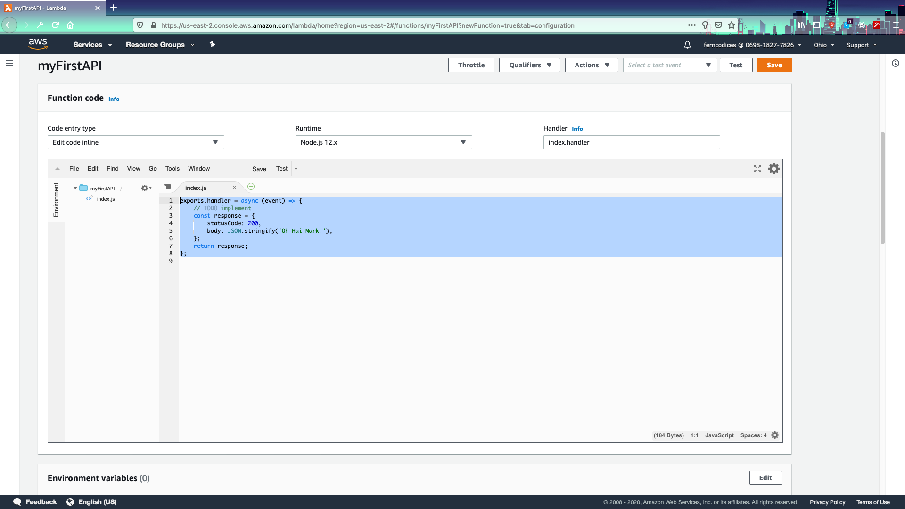

## Invoking your lambda

OKAY- so now we need to INVOKE our lambda. Here's where things can get tricky! The first thing we're going to do is check to make sure that we have our credentials loaded...so everyone go into your credentials file or just do a 
`cat ~/.aws/credentials`

Make sure that you have the correct profile name there (it's okay if it's default). 

_This is how we're giving permission to invoke the lambda_

NOW let's go to your command line and call your lambda function!

Type the following:

`aws lambda invoke --function-name ${your function name} --profile ${your profile} --region ${your region} out.txt`

SO- to break this up:

* `aws lambda invoke`: Should be pretty obvious from the name
* `--function name`: How we're finding our function
* `--profile`: Which AWS profile to use (if you have multiple clients you might have many)
* `--region`: Region where the lambda is located

Now go in and `cat out.txt`. What does the response say?

## Meanwhile back in the management console...

Okay...so let's head back to the management console to take a look at how everything worked. 
FIRST click on the "Monitoring" tab.

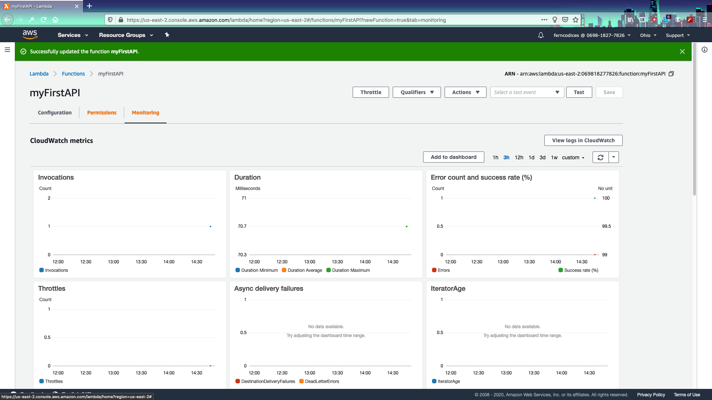

SO- from here we can see a basic layout of useful information (invocations, durations, error counts, etc). 
Fern will go through these with you. Let's now take a look at the LOGS.

Remember that we put a `console.log` note in there? Click on "View logs in Cloudwatch" on the right. You should see a screen that looks like this:

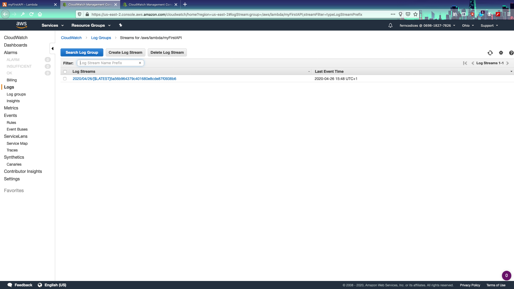

Now click on the link there and you should see something like this:

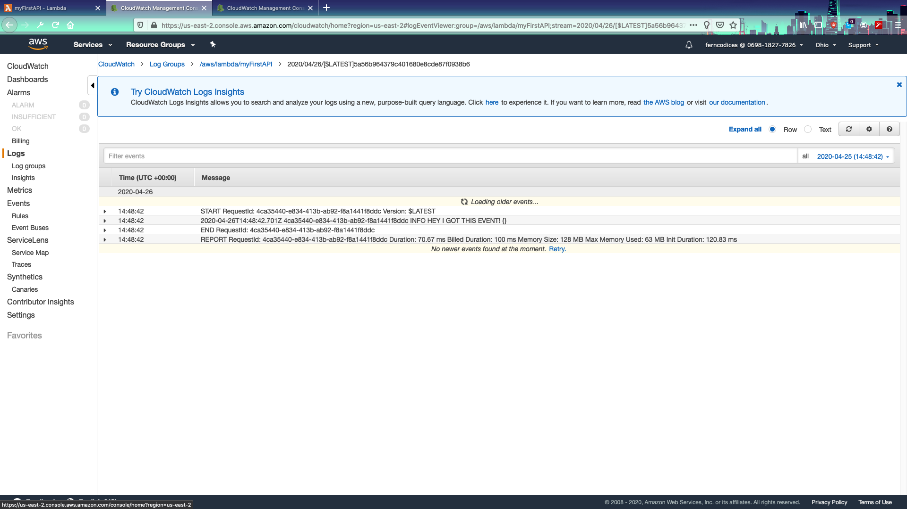

NOW...as we did not actually **pass** an event there is a blank spot there so on to a **challenge**

## CHALLENGE ONE: 

Invoke your lambda with an EVENT. Log that event out to the cloudwatch stream. Look up how to pass an event to your lambda!

## Setting up triggers to make your lambda run on it's own...

NOW we're going to create a way to add triggers to this lambda.
See- Lambdas are just basically pieces of code waiting to be run...they need something to trigger them. 
In our case we're going to use **AWS SQS**- which is a simple messaging service.

FIRST go back to the configuration tab of the lambda. Click on "Add trigger"

Here we have a list of all of the different triggers that can set off our lambda. Fern will describe a bunch of these all with different "events" which can be passed on to the lambda as JSON objects. The lambda can then process these objects and pass them on to a "Destination". 

Let's choose "SQS" for this one.

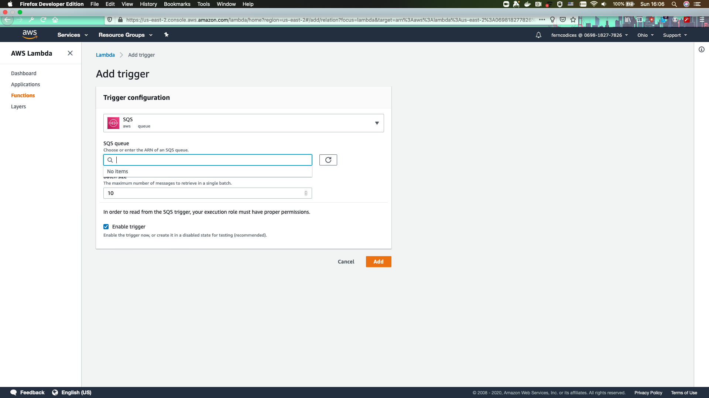

Oh SHOOT! We NEED an SQS queue created before we can use this (as shown when you open SQS). 

No problem. **Open up a new tab** and let's create an SQS queue!

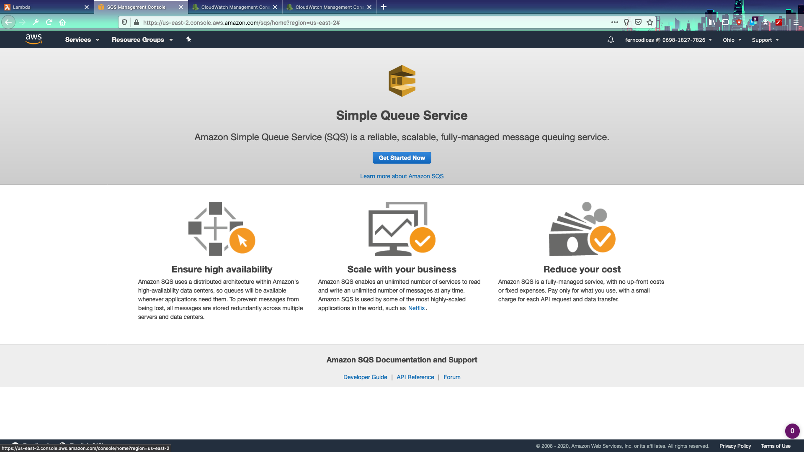

Let's make the following:

* Queue Name: Whatever you'd like
* Standard Queue
* Quick-Create Queue

Has your queue been created? Do you have a screen like this?

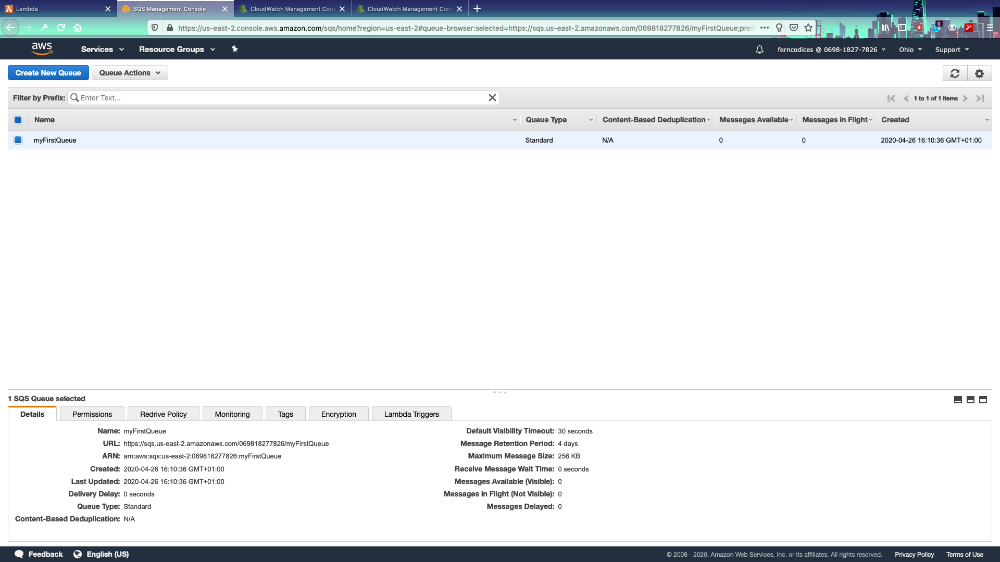

If you do then awesome! Let's configure this messaging queue to be a trigger for a lambda function. Go up to the name of your queue and right click it. Select **Configure Queue for Lambda Function**

You should get a pop up that looks like this. Select your lambda function and save

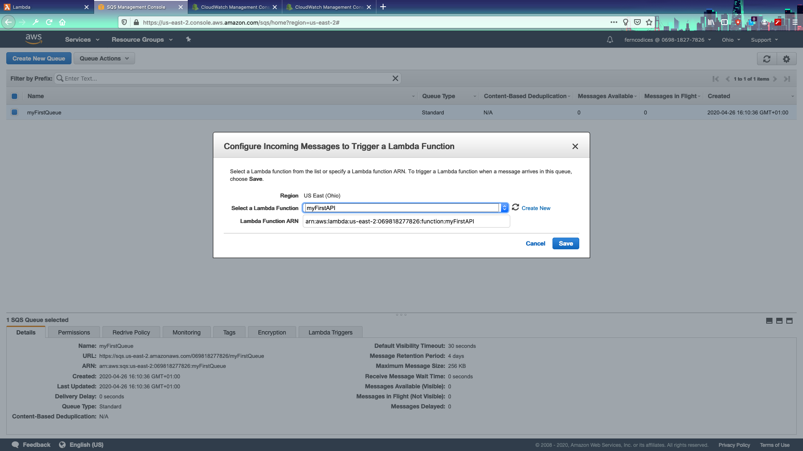

NOW- if you got a permissions error message FEAR NOT. We can solve that! Let's go BACK to our lambda function and choose "Permissions". You should see an EXECUTION ROLE at the top of the screen there, right?
Awesome! 

Click on the link under "Role Name"

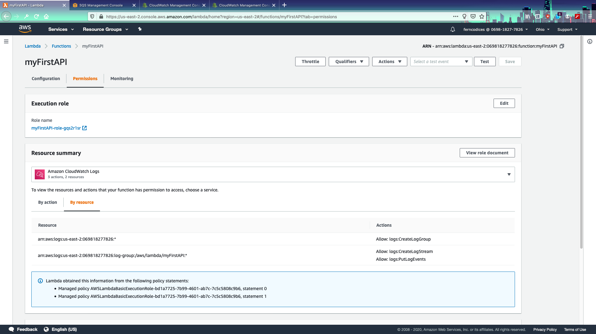

That should take you to the IAM page for that role! 

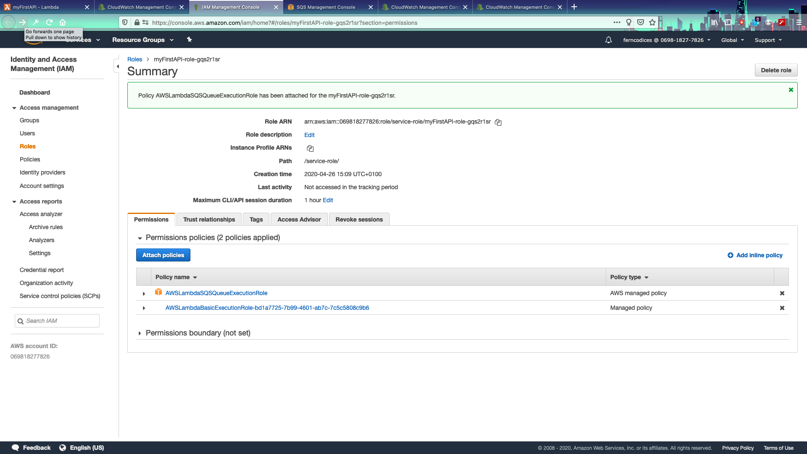

NOW- let's "Attach a policy" and do a search for "SQS". See what that gets you...

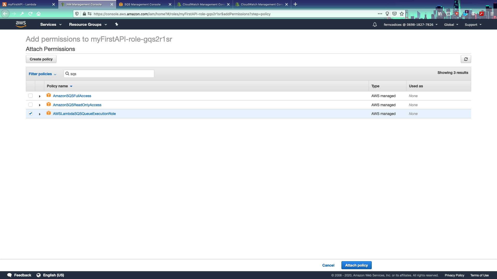

Which one of these options do you think we should use? 

OKAY...once that is done...go back and....

## CHALLENGE TWO: 

Make this work!!

### TRIGGERING out Lambda with a message

NOW- remember that all lambda messages are being printed out to logs (THAT is how we know that they worked!) SO...let's test by sending a message. 

FROM THE SQS QUEUE page, right click on your QUEUE name and choose "Send message"

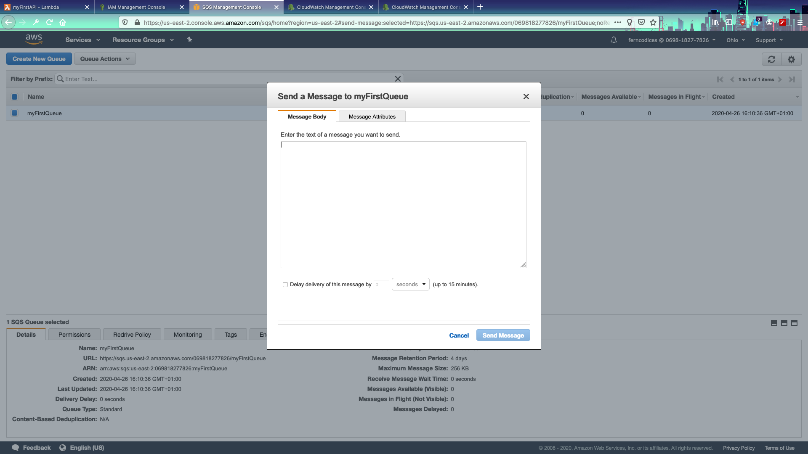

Write whatever you want into that message box! ("Johnny is my BEST FRIEND")

NOW...let's go BACK to our lambda and see if that message has been picked up!

## CHALLENGE THREE:
How do we see if the message has been picked up??

END lab ONE

