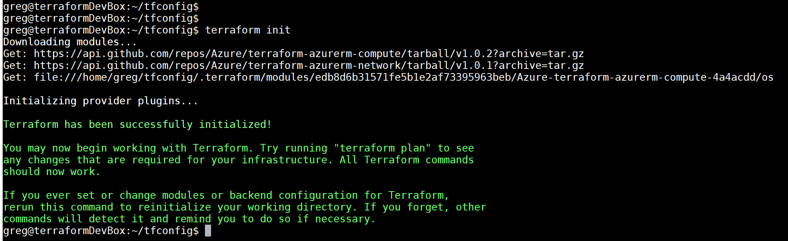

# Lab Three TERRAFORM: Creating our first resources with Terraform

So hopefully at this point we have our local environment set up already. If you don't please refer to the README at the beginning of this lab.

## Set up terraform directory structure

First step is to go into the **./app** folder and add in a **./terraform** directory: `mkdir terraform`.
When setting up for an aws application it is advisable that you keep your **terraform** files separate from your application (code) files. Terraform, if you recall from the lecture portion, __appends__ all of the terraform files in a directory together (except for __overwrite__ files which are merged). You don't want code interfering with that!

Next step is to create the three files in the terraform directory: **variables.tf**, **main.tf**, **outputs.tf** and we're going to add another one for later: **template.tf**. So make these directories (on linux/unix just **touch** them. In windows...do the windows thing that creates files)

### Creating the first terraform file

In the `main.tf` file the first section we are going to create is the **provider** setion. As we're using aws for this course the parameters for this section should be pretty obvious:

```terraform
provider "aws" {
  access_key = "ACCESS_KEY_HERE"
  secret_key = "SECRET_KEY_HERE"
  region     = "eu-west-1"
}
```

So now we come to a minor issue: __we don't want to commit our access keys to git__. Obviously this would be a security issue...so from here we have several options:

* We can utilize the __~./aws/credentials__ file profiles on our local host machine
* We can utilize the AWS environment variables on our host machine
* We can simply put all of our key variables into our var file and not commit **variables.tf**

The advantage here is that we can commit a tf file that simply maps to the credentials on the host machine. SO- terraform will use the **default** profile by default... but if you have multiple profiles that look like this:

```shell
[default]
aws_access_key_id=<access_key>
aws_secret_access_key=<secret_access_key>

[wiseau]
aws_access_key_id=YOURACCESSKEY
aws_secret_access_key=SECRETKEY
```

Then you can do this:

```terraform
provider "aws" {
  profile    = "wiseau"
  region     = "eu-west-1"
}
```
We're ready to go now! Edit your **main.tf** file so that you totally get rid of everything but the region. It should now look like this:

```terraform
provider "aws" {
  profile    = "wiseau"
  region     = var.region
}
```

Obviously we're going to have to define that region variable...so let's go into our **variables.tf** file and put in the following:

```terraform
variable "region" {
    type = "string"
    description = "This is the region we want to deploy to. If you want to change the region do it here"
    default = "eu-west-1"
}

variable "profile" {
    type= "string"
    description = "This is the string representation of the aws profile we want to use"
    default = "wiseau"
}

variable ec2type {
    type = "string"
    description = "This is the ami for the type of ec2 instance we want to deploy"
    default = "ami-06b41651a26fbba09"
}
```

This should make sense based on the lecture portion.

Now we're ready to move on to creating resources. Let's start with an EC2 instance!

### Creating our first ec2 instance

We're going to start with an EC2 instance (in my experience these are the most common resources we provision __except for__ lambda resources...which we'll get to later). Recall from the lectures how we provision resources. We're going to start with a very basic image:

```terraform
resource "aws_instance" "firstec2" {
  ami           = var.ec2type
  instance_type = "t2.micro"
}
```

The **t2.micro** is used to keep everything in the free tier. The **ami** type can be found [here](https://cloud-images.ubuntu.com/locator/ec2/)..but spoiler: we're going with a basic ubuntu image.

So now your **main.tf** file should look like this:

```terraform
provider "aws" {
  profile    = var.profile
  region     = var.region
}

resource "aws_instance" "firstec2" {
  ami           = "ami-047bb4163c506cd98"
  instance_type = "t2.micro"
}
```

Now we're ready to go. Let's **initialize**, **plan** and **apply** the terraform to get this ec2 instance deployed:

### Terraform init, plan, apply

So from within your container navigate to your **terraform** directory (`cd ./terraform` assuming you mounted the **app** directory).
Okay- so the first step from within this file (check that you are next to **main.tf** with a quick `ls`) run the following command: `terraform init`

Did it work?

This is the point where terraform will download the appropriate plugins (now that it knows that you are using **aws**) and create a hidden **.terraform** directory that contains the downloaded plugins. If you received a message that looks like this then you have successfully initialized your terraform directory. It's worth saying this again: **keep these directories separate from application logic**



So that is the __init__ step. 
Let's get on to the __plan__ step! 
At a simple level let's add in a __plan__ here to see what the new resource is going to look for. Whilst still in the same directory as your terraform files run a `terraform plan`. You should see something that has a `+create` at the beginning (in green maybe(?)) and a `+aws_instance.myfirstec2`. 
Now- this might blow your mind but the "+" sign means that we are __adding__ a resource (and it's green)....so if you had to guess- what would the __destroy__ markings look like?
Now that you have the plan ready (basically summarizing what's going to change) you can __apply__ the changes by going into the command line and typing in `terraform apply`

Now let's look at the plan: **1 to add, 0 to change, 0 to destroy**.
Do you want to perform these actions? 
Type in `yes`

**It is possible that you received an error that said that you do not have permissions to create this resource. I am not going to put the answer in here because you guys have the power to get this one done**


If we need to...let's take five to get this last problem solved. It is the next challenge in this lab.

Once you have completed this we need to make sure that our resource has been created. Let's head back to our aws management console and make sure that we can see the ec2 instance that we created (they will show up in our **default** vpc by, uh, default). **Don't forget about the region** (which you can change in the top right hand corner).


You should see the ec2 instance now in existence. **Congratulations!** we have deployed a resource. 
Now let's get some information about that resource!
Type: `terraform show` into the command line. Check out the information there (including the public IP address). This can be useful (but could it be even MORE useful with OUTPUT variables??)

### Creating a Keypair

So- assuming that you've gone onto the console to check the status of your ec2 instance...well...it's not doing you much good right now. Try right-clicking on it and choose `connect`. Do you see something like this?


Why? 
Simple: There is no ssh key pair associated with it. In other words- we've basically created a brick wall without a door to allow us entry.


So we need a way INTO this ec2 instance in order for it to do us __any__ good whatsoever. So let's work on that now. The first step here is to create some local ssh keys. Once we have those we're going to zip them up to our ec2 instance and that will act as our keypair. So let's do that:

1. The first thing to note is that, although terraform does technically __have__ an **aws_key_pair** resource- it can **not** be used to create a new key pair. Instead we have to have one already created locally. Fortunately doing that is pretty simple:

    * **For MAC users:** Pretty simple: `ssh-keygen -t rsa -b 4096 -C "youremail@email.com"`. Once you are asked for a file in which to save the key put in (from the root directory here): `./app/terraform/keys/practicekey.pem`.
    * Hit enter.
    * Choose `NO PASSPHRASE`.
    * Hit enter twice more.
    * You should have a file called `practicekey.pem` and `practicekey.pem.pub` created.
    * PUB is for PUBLIC- basically that is the file you will be sending to your ec2 instance to allow it's use
    
    * **For WINDOWS users (this works as of a 2019-04-07 update):** Buy a mac. (Just kidding). Open up a `cmd` window by opening the search box in the bottom left and typing in `cmd`. It will default to your HOME folder. 
    * Change directories to the root folder of this project.
    * Type in `ssh-keygen -t rsa -b 4096 -C "youremail@email.com"` and call your key `practicekey.pem`. 
    * Do NOT include a passphrase
    * Put the file in `./app/terraform/keys/practicekey.pem`

    * **WINDOWS users for whom the previous command did not work:** You can also use [putty](https://www.chiark.greenend.org.uk/~sgtatham/putty/latest.html) to generate an ssh key on windows. Click that link, install putty, and then follow these [instructions](https://docs.joyent.com/public-cloud/getting-started/ssh-keys/generating-an-ssh-key-manually/manually-generating-your-ssh-key-in-windows)

### Passing keypair to ec2

Assuming that everyone now has an ssh key generated we are ready to pass this data into our EC2 instance! So let's talk about how to do that. 

1. The first thing to realize is that AWS needs a copy of your ssh keys. Thus far your ssh key exists _solely_ on your local drive. AWS needs to "know" about them so that it can pass them on to your ec2 instance. This means a new **resource**.

2. So back to our terraform files! Let's add everything in. Let's go to our **main.tf** file and add this resource:

```terraform
resource "aws_key_pair" "ec2key" {
  key_name   = "myec2key"
  public_key = var.ssh-key
}
```

3. And, of course, we'll need to add in to our variables file:

```terraform
variable "ssh-key" {
    type="string"
    description = "The ssh key to access our practice ec2 instance"
    default = "ssh-rsa AAAAB3NzaC1yc2EAAAADAQABAAACAQCe/YMRL8/x5hc1okhkdiC3ijoWLw1BtnpFNc5OjpqbDXFKSNe/T/Ba97+zua8JQG6o8eA8EkBcYldNhTGSDGJaWROthp2WgeZdQsAWk3+XC5aRtxjLFdutSfrY0CErSIU0K6++J+v6s4CrgBEoUcz5BUMawqV7VphUKOkH3j8tkK6kDEHZOqwjSOiZQ4xafW0Pc85skp4iU/FcsfdsfdsEA4JVZps3e15YByBCIL0AzmwZ10wTnX4zwxBG3tlj5DaeJsJHs2BhVMbS6MQhE2WF1R5d/RQVihxvZSBC9EZ2ZEVZOU5lZky3AA5wWXWy/UWzqo/V3mgukAPsYnTviy497iOZm2SNGnGckIR8hqLByjLDq7HMrIf1BSU3PtDWH0ge7NdYjV9he/64HtgpXUnDywM6tcoNUcO0suilal0QMV3arWsUiQ4Z5OpLOm+IV1PGBuchMxoPg6cyUSJCPHMg65h8pFEB0O3i5+hlG8XH4jifyermYiOtRV1UBAUw9rQoMzRNG8KdxWu7QAFtabYU1QV45G9ZO145hKKgcs2eiqH9fcugpTTaH214H+jRPFkhcJUXl6BVbZ2YKP/8H5wcS8xKbrtepKF3jLVXpSk5fk/YDYbzVMp49ftMSogcFJBrz8iFTj4CYbpQkmaV+JoEd4mvsREU+yt/MvwAqoSQTw== fernincornwall@gmail.com"
}
```

4. UGH- there MUST be a better way than that!! Let's use terraform's handy **file** command! So instead...delete that `ssh-key` entry in **variables.tf** and, instead, in **main.tf** write this in (obviously for windows reverse the slashes):

```terraform
resource "aws_key_pair" "ec2key" {
  key_name   = "myec2key"
  public_key = file("./keys/practicekey.pub")
}
```

5. The **file** command, as you can see, READS files directly (as utf-8 strings) which is what we're demanding here. SO- now we're ready:

6. `terraform plan` and then `terraform apply`. 

7. Once everything is finished loading go into your management console and try right-clicking on your resource. Click "Connect" from there:


8. Now try ssh-ing in to your instance by typing this into the command line from your computer (if you are on windows you might need to use putty-gen or cmd...also- this is assuming that you are in the root of module 01. Obviously replace the ec2 name with whatever YOUR ec2 instance public DNS name is...).

`ssh -i "./app/terraform/keys/practicekey" ubuntu@ec2-34-245-40-53.eu-west-1.compute.amazonaws.com`

9. If you were able to get in then congratulations! You have a fully formed ec2 instance ready to go! LET'S DESTROY IT!

### Deleting a resource:

Our final exercise here will be to **delete** a resource with terraform.
We do this (conveniently enough) with the **destroy** keyword in terraform:
`terraform destroy`

This should take down the resources created.