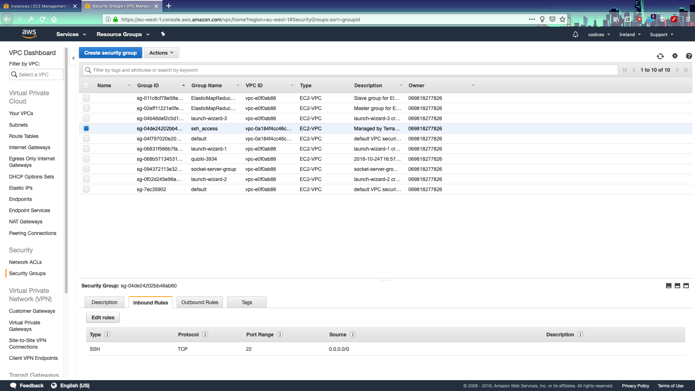

# Lab Five: Creating VPCs with Terraform

## VPC with EC2

1. As we went over in the lectures: VPCs are an essential ingredient in creating a network for your EC2 instance. In this lab we will be creating a VPC and placing **two** ec2 instances in it- one __public__ and one __private__.

2. Copy over all of the files from the previous section into your **app/** folder. Now- as we'll be adding a unique resource let's give it a personalized file. Add in a file called **vpc.tf**. That's where we'll put the vpc data. Also, while we're at it-- let's change the name from **main.tf** to **ec2.tf**. This is a huge advantage in terraform- we can organize our resources effectively into different files.

3. General advice here- when setting up a terraform infrastructure the best method is to START by going online and finding the resource and then kind of working backwards to fill it in. So in that spirit- let's __start__ by creating our vpc resource in our **vpc.tf** file. NOTE that you need to have your CIDR block here and we are allowing dns support and hostnames to allow easy access to the ec2 instance:

```terraform
resource "aws_vpc" "practice_vpc" {
  cidr_block = var.cidr_vpc
  enable_dns_support   = true
  enable_dns_hostnames = true
  tags = {
    Environment = var.environment_tag
  }
}
```

5. As you've probably noticed- there are a couple of variables there that we need to add back into our **variables.tf** blocks...so let's do that now:

```terraform
variable "cidr_vpc" {
  description = "CIDR block for our practice VPC"
  default = "10.1.0.0/16"
}

variable "environment_tag" {
  description = "This is the environment tag that we will use"
  default = "development"
}

```

6. Now we'll need a subnet WITHIN our vpc with it's own CIDR block within a given availability zone. So we're going to create that here to allow public access to our network (we're creating a web network after all!). So add this to your **vpc.tf**:

```terraform
resource "aws_subnet" "subnet_public" {
  vpc_id = aws_vpc.practice_vpc.id
  cidr_block = var.cidr_subnet
  map_public_ip_on_launch = "true"
  availability_zone = var.availability_zone
  tags = {
    Environment = var.environment_tag
  }
}
```

7. In the above section notice the use of the reference to another resource (specifically **aws_vpc.practice_vpc.id**). Note from our lecture that this follows the format of __resource__ DOT __name__ DOT __parameter__...in this case the vpc ID- which is needed to link the subnet to the vpc.

8. Obviously we need the **cidr_subnet** variable and the **availability_zone** variables added...so let's hop onto that by adding these to **variables.tf**:

```terraform
variable "cidr_subnet" {
  description = "CIDR block for the subnet"
  default = "10.1.0.0/24"
}
variable "availability_zone" {
  description = "availability zone to create subnet"
  default = "eu-west-1a"
}
```
9. Okay- so some decisions to make...do we want this VPC open to EVERYONE? NOONE? What is the purpose?
So there are two ways to handle ingress/egress from resources in your vpc..through the ACL (Access Control List- think of it as the **firewall** in your VPC) and then there are **security groups** which we can use for more granular access. 
For this project we will be controlling ingress/egress via **security groups** which means that we're going to go ahead and tell the firewall to just let everyone in. So in your **vpc.tf** add in the following resource:

```terraform
resource "aws_network_acl" "all" {
    vpc_id = aws_vpc.practice_vpc.id
    egress {
        protocol = "-1"
        rule_no = 2
        action = "allow"
        cidr_block = "0.0.0.0/0"
        from_port = 0
        to_port = 0
    }
    ingress {
         protocol = "-1"
         rule_no = 1
         action = "allow"
         cidr_block = "0.0.0.0/0"
         from_port = 0
         to_port = 0
    }
    tags = {
         Environment = var.environment_tag
    }
}
```

10. Now- as stated before this is a __public__ subnet- so obviously we would like it to be internet-accessible (again- we'll do both a PUBLIC and PRIVATE subnet- the PRIVATE one will talk to our Database and be the location of most of our app code while the PUBLIC subnet will handle the front end). This means that a **gateway** is needed to allow internet access through our cloud network. This means a **gateway resource**


11. Add the following to your **vpc.tf** file:

```terraform
resource "aws_internet_gateway" "igw" {
  vpc_id = aws_vpc.practice_vpc.id
  tags = {
    Environment = var.environment_tag
  }
}
```

12. Now we need to add this aws gateway to our **route table** to allow ingress from the internets...and so to do that we'll have to add a route-table that references our vpc...so also in our **vpc.tf**:

```terraform
resource "aws_route_table" "rtb_public" {
  vpc_id = aws_vpc.practice_vpc.id
route {
      cidr_block = "0.0.0.0/0"
      gateway_id = aws_internet_gateway.igw.id
  }
tags = {
    Environment = var.environment_tag
  }
}
```

13. So now we have a route-table connected to the internet-gateway but we still don't have the route-table associated to our "public" subnet...which means another resource to lock those two together: **aws_route_table_association**. Again: Notice the use of the reference to another resource. In **vpc.tf**:

```terraform
resource "aws_route_table_association" "rta_subnet_public" {
  subnet_id      = aws_subnet.subnet_public.id
  route_table_id = aws_route_table.rtb_public.id
}
```

14. Okay- so Internet_gateway->Public_subnet->VPC looks good at this point. Basically the traffic will be routed IN through the internet gateway, through the **public** subnet which is part of the **VPC** (which can also hold a PRIVATE subnet for talking to our databases- which we'll get to). So the last thing we have to do is to edit our EC2 instance (in **main.tf**) and associate it with our vpc!

15. SO- to begin the association we probably want to lock down our EC2 instance and allow ingress **only** through ssh- which defaults to **port 22**. This means that port 22 must be **open** on our ec2 instance. To open and close various ports we'll want to use **security groups** which means, you guessed it...__another resource__. In **vpc.tf**:

```terraform
resource "aws_security_group" "ssh_access" {
  name = "ssh_access"
  vpc_id = aws_vpc.practice_vpc.id
  ingress {
      from_port   = 22
      to_port     = 22
      protocol    = "tcp"
      cidr_blocks = ["0.0.0.0/0"]
  }
 egress {
    from_port   = 0
    to_port     = 0
    protocol    = "-1"
    cidr_blocks = ["0.0.0.0/0"]
  }
  tags =  {
    Environment = var.environment_tag
  }
}
```

16. Finally- let's associate __all__ of this VPC stuff with our ec2 instance by going BACK into **main.tf** and altering the ec2 instance there as follows:

```terraform
resource "aws_instance" "myfirstec2" {
  ami           = var.ec2type
  instance_type = "t2.micro"
  key_name = "myec2key"
  subnet_id = aws_subnet.subnet_public.id
  vpc_security_group_ids = [aws_security_group.ssh_access.id]
  
  tags = {
      Environment = var.environment_tag
  }
}
```

17. OKAY! That's it...we're ready to **init/plan/apply!**.


18. As our last step we're going to go into the console and make sure that our "webserver" exists...so log into your aws account and check that it exists first:


19. Now check that your new VPC and security groups exist by going to the VPC section in the management console and checking for TAGS (as we can't name the vpc on launch you can name it now...it's the one with the ENVIRONMENT: DEVELOPMENT tag associated with it):


20. And finally...security groups...on the left side of the screen and it should have INBOUND RULES that say "PORT 22" is open:



### Quick review of OUTPUTS

1. So the biggest pain about that last scenario (when we are doing our verifications)was going in to the aws management console and figuring out which resource we created. NAME wasn't always associated (or possible to add)...so the ideal would be that once we create everything we would OUTPUT it. THAT (at long last) is where our OUTPUT.TF file will come in handy.

2. A couple of useful pieces of information from that last deployment might have been the public dns of our ec2 instance (although we haven't opened up port 80 or port 443 yet) and maybe the ID of our VPC so we know what to look for. In that spirit let's go ahead and add those in. 

3. BUT before we do that let's take a quick look at where they are __coming from__. Go to your console (from within your module_02 terraform directory) and type in `terraform show`. 

4. With that handy little list you can get information about all of the various resources that are deployed from within this particular terraform folder....specifically things like "Security group IDs", "VPC IDS" and "PUBLIC DNS'". We can use these in our **outputs.tf** file to output that information upon deployment of new resources. Hop over to that and add this line:

```terraform
output "public_dns" {
    value = aws_instance.myfirstec2.public_dns
}

output "public_ip" {
    value = aws_instance.myfirstec2.public_ip
}

output "vpc_id_so_we_can_spot_easily" {
    value = aws_vpc.practice_vpc.id
}
```

5. So congratulations- we've managed to create some EC2 instances BUT....now we want to provision them somehow (I mean...an empty ec2 instance is nice but really-- what good is it on its own?). So for our next step we are going to need to add in two more ingredients, an [elastic_ip](https://docs.aws.amazon.com/AWSEC2/latest/UserGuide/elastic-ip-addresses-eip.html) which will allow us to quickly remap the incoming IP in case of an ec2 failure and/or...well- we don't want to have to change the IP address **every.single.time** we need to restart the ec2 instance, right?

6. So let's go into our **main.tf** file and add in the "eip":

```terraform
resource "aws_eip" "practice_eip" {
  vpc       = true
  instance  = aws_instance.instance.id
  tags = {
    Environment = var.environment_tag
  }
}
```

7. Now **plan** and **apply** again and see what comes up at the end!

8. Want to see another neat trick? Run `terraform output public_ip`. This basically echoes the output value to the command line SO...if you need to write a bash script for post-terraform deployments you can simply add this line in and echo out any output variables you created as a string!

9. ALSO- try running this feature: `terraform graph` and you get a nice little output of your dependencies. IF you're feeling fancy you can create a nice visualization of your current infrastructure with `terraform graph | dot -Tpng > graph.png`!
    * **WARNING**- if you're on mac you may have to install graphviz with `brew install graphviz`. If you're on windows you can install [here](https://graphviz.gitlab.io/download/)

## Private Subnet and Database

1. SO- this is fine so far...we have a public facing "web server" and a vpc BUT...in order for it to do **any** good whatsoever we need it to be able to speak to a BACK END of some sort (i.e data...since a web site is basically...you know: a data repository!)

2. So let's start with creating a PRIVATE subnet within the vpc (remember that the vpc can have both a **public** and a **private** subnet that can speak to each other via a nat gateway):


3. By now this should look familiar...basically the same as the public but with maybe a different availability zone, definitely NOT mapped public:

```terraform
resource "aws_subnet" "subnet_private" {
  vpc_id = aws_vpc.practice_vpc.id
  cidr_block = var.private_cidr_subnet
  map_public_ip_on_launch = "false"
  availability_zone = var.private_availability_zone
  tags = {
    Environment = var.environment_tag
  }
}
```

4. AND- as you've probably noticed- we need to alter a lot of variables here (notice the changes that I've made- to the default value of the private subnet, the availability zone)..so in **variables.tf**:

```terraform
variable "private_availability_zone" {
  description = "availability zone to create the public subnet"
  default = "eu-west-1b"
}

variable "private_cidr_subnet" {
  description = "CIDR block for the PRIVATE subnet"
  default = "10.1.3.0/24"
}
```

5. AND of course the new private subnet will need route table associations built for it as well...BUT- we don't want the **internet gateway** to be the ingress...so instead we'll need a **nat gateway** access only...which means that we need a **nat_gateway** resource. So in **vpc.tf**:

```terraform
resource "aws_route_table" "rtb_private" {
  vpc_id = aws_vpc.practice_vpc.id
route {
      cidr_block = "0.0.0.0/0"
      nat_gateway_id = aws_nat_gateway.practice_nat.id
  }
tags = {
    Environment = var.environment_tag
  }
}

resource "aws_route_table_association" "rta_subnet_private" {
  subnet_id      = aws_subnet.subnet_private.id
  route_table_id = aws_route_table.rtb_private.id
}

resource "aws_nat_gateway" "practice_nat" {
    allocation_id = aws_eip.practice_eip.id
    subnet_id = aws_subnet.subnet_public.id
   depends_on = ["aws_internet_gateway.igw"]
}
```

6. Okay- so now that we are associating the elastic IP with the **nat_gateway** __instead of__ directly with the ec2 instance (check the image here):


SO- now we have an elastic IP pointing to the NAT instead- so change the **eip** in **vpc.tf** to just a basic, floating, unassociated resource:

```terraform
resource "aws_eip" "practice_eip" {
  vpc       = true
  tags = {
    Environment = var.environment_tag
  }
}
```

### Quick review

SO- before we move on let's do a quick review to make sure we are all in the same place.

#### vpc.tf

```terraform
resource "aws_vpc" "practice_vpc" {
  cidr_block = var.cidr_vpc
  enable_dns_support   = true
  enable_dns_hostnames = true
  tags = {
    Environment = var.environment_tag
  }
}

resource "aws_subnet" "subnet_public" {
  vpc_id = aws_vpc.practice_vpc.id
  cidr_block = var.cidr_subnet
  map_public_ip_on_launch = "true"
  availability_zone = var.availability_zone
  tags = {
    Environment = var.environment_tag
  }
}

resource "aws_internet_gateway" "igw" {
  vpc_id = aws_vpc.practice_vpc.id
  tags = {
    Environment = var.environment_tag
  }
}

resource "aws_route_table" "rtb_public" {
  vpc_id = aws_vpc.practice_vpc.id
route {
      cidr_block = "0.0.0.0/0"
      gateway_id = aws_internet_gateway.igw.id
  }
tags = {
    Environment = var.environment_tag
  }
}

resource "aws_route_table_association" "rta_subnet_public" {
  subnet_id      = aws_subnet.subnet_public.id
  route_table_id = aws_route_table.rtb_public.id
}

resource "aws_security_group" "ssh_access" {
  name = "ssh_access"
  vpc_id = aws_vpc.practice_vpc.id
  ingress {
      from_port   = 22
      to_port     = 22
      protocol    = "tcp"
      cidr_blocks = ["0.0.0.0/0"]
  }
 egress {
    from_port   = 0
    to_port     = 0
    protocol    = "-1"
    cidr_blocks = ["0.0.0.0/0"]
  }
  tags =  {
    Environment = var.environment_tag
  }
}

resource "aws_subnet" "subnet_private" {
  vpc_id = aws_vpc.practice_vpc.id
  cidr_block = var.private_cidr_subnet
  map_public_ip_on_launch = "false"
  availability_zone = var.private_availability_zone
  tags = {
    Environment = var.environment_tag
  }
}
resource "aws_network_acl" "all" {
    vpc_id = aws_vpc.practice_vpc.id
    egress {
        protocol = "-1"
        rule_no = 2
        action = "allow"
        cidr_block = "0.0.0.0/0"
        from_port = 0
        to_port = 0
    }
    ingress {
         protocol = "-1"
         rule_no = 1
         action = "allow"
         cidr_block = "0.0.0.0/0"
         from_port = 0
         to_port = 0
    }
    tags = {
         Environment = var.environment_tag
    }
}

resource "aws_route_table" "rtb_private" {
  vpc_id = aws_vpc.practice_vpc.id
route {
      cidr_block = "0.0.0.0/0"
      nat_gateway_id = aws_nat_gateway.practice_nat.id
  }
tags = {
    Environment = var.environment_tag
  }
}

resource "aws_route_table_association" "rta_subnet_private" {
  subnet_id      = aws_subnet.subnet_private.id
  route_table_id = aws_route_table.rtb_private.id
}

resource "aws_nat_gateway" "practice_nat" {
    allocation_id = aws_eip.practice_eip.id
    subnet_id = aws_subnet.subnet_public.id
    depends_on = ["aws_internet_gateway.igw"]
}
```

#### main.tf

```terraform
provider "aws" {
  profile    =  var.profile
  region     =  var.region
}

resource "aws_instance" "myfirstec2" {
  ami           = var.ec2type
  instance_type = "t2.micro"
  key_name = "myec2key"
  subnet_id = aws_subnet.subnet_public.id
  vpc_security_group_ids = [aws_security_group.ssh_access.id]
  
  tags = {
      Environment = var.environment_tag
  }
}

resource "aws_eip" "practice_eip" {
  vpc       = true
  tags = {
    Environment = var.environment_tag
  }
}

resource "aws_key_pair" "ec2key" {
  key_name   = "myec2key"
  public_key = file("./keys/practicekey.pub")
}
```

#### variables.tf

```terraform
variable "region" {
    type = "string"
    description = "This is the region we want to deploy to. If you want to change the region do it here"
    default = "eu-west-1"
}

variable "profile" {
    type= "string"
    description = "This is the string representation of the aws profile we want to use"
    default = "codices"
}

variable "ec2type" {
    type = "string"
    description = "This is the ami for the type of ec2 instance we want to deploy"
    default = "ami-03746875d916becc0"
}

variable "key_pair_name" {
    type = "string"
    description = "The key pair to access our ec2 instance"
    default = "practicekey"
}

variable "cidr_vpc" {
  description = "CIDR block for the VPC"
  default = "10.0.0.0/16"
}

variable "cidr_subnet" {
  description = "CIDR block for the subnet"
  default = "10.0.0.0/24"
}
variable "availability_zone" {
  description = "availability zone to create the public subnet"
  default = "eu-west-1a"
}

variable "private_availability_zone" {
  description = "availability zone to create the public subnet"
  default = "eu-west-1b"
}

variable "private_cidr_subnet" {
  description = "CIDR block for the PRIVATE subnet"
  default = "10.0.1.0/24"
}
variable "environment_tag" {
    description = "This is the environment tag that we will use"
    default = "development"
}
```

## Creating our databases

1. Okay- so now we have a private subnet set up with a nat gateway that allows it to speak to the public subnet within the same VPC. The last ingredient here is to set up a back end database that speaks ONLY to the private subnet (assuming you don't want to grant open access to your database to the wider internet).

2. As we're big proponents of managing as little of our own infrastructure as possible we should make a move to have AWS manage our database infrastrucure (managing our own MYSQL or REDSHIFT databases can be incredibly painful and time consuming...though if you __really__ want to do that you can use terraform [provisioners](https://www.terraform.io/docs/provisioners/index.html) like [ansible](https://www.ansible.com/) to do this for you).

3. So our first job will be to create an instance. Let's create a file called **database.tf** in our **terraform** folder. We're going to be using **redshift** here as it's one of AWS' more amazing databases (works with postgresql and we can easily hook up other neat things...like [firehose](https://aws.amazon.com/kinesis/data-firehose/) to it to allow us to stream data). So let's start with that:

4. In your **database.tf** file put the following:

```terraform
resource "aws_redshift_cluster" "practice_redshift" {
  cluster_identifier = "redshift-practice-cluster"
  database_name      = "salesforcedata"
  master_username    = "salesforcedi"
  master_password    = "Mustbe8characters"
  node_type          = "dc1.large"
  cluster_type       = "single-node"
  cluster_subnet_group_name = aws_redshift_subnet_group.rs_subnet.name
  skip_final_snapshot = true
  publicly_accessible = true
  vpc_security_group_ids = [aws_security_group.redshift_access.id]
  tags = {
    Environment = var.environment_tag
  } 
}
```

5. You can probably see here where we're going to need to create a few more resources in the same file (we need a subnet group JUST for redshift because...reasons. Also a fresh security group because who the heck wants to ssh into a database instance anyway, amirite?) Let's get that taken care of now in your **database.tf** file:

```terraform
resource "aws_redshift_subnet_group" "rs_subnet" {
    name = "practicerssubnet"
    subnet_ids = [aws_subnet.subnet_public.id]
    tags = {
        Environment = var.environment_tag
    }     
}

resource "aws_security_group" "redshift_access" {
  name = "redshiftaccess"
  vpc_id = aws_vpc.practice_vpc.id
  ingress {
      from_port   = 5439
      to_port     = 5439
      protocol    = "tcp"
      cidr_blocks = ["0.0.0.0/0"]
  }
 egress {
    from_port   = 0
    to_port     = 0
    protocol    = "-1"
    cidr_blocks = ["0.0.0.0/0"]
  }
  tags =  {
    Environment = var.environment_tag
  }
}
```

6. Now please make note of a lot of the various aspects we're working on here! First off notice that we've added redshift to our PUBLIC subnet. In a production environment you might not want to do this but in a development environment...well- notice that you can also control the EGRESS and INGRESS IP addresses in the above security group. So if you are really worried you can set up a quick vpn and allow only ingres by porting through that vpn.

7. ALSO- note that I am keeping port 5439 open...this is the default port for redshift. FINALLY- it would be usefull to see if we can connect to our cluster so let's go ahead and append some basic data to our **outputs.tf** file so that we can grab the correct connection adn endpoint data at the end. Append these in **outputs.tf**:

```terraform
output "redshift_connection" {
    value = aws_redshift_cluster.practice_redshift.dns_name
}

output "redshift_endpoint" {
    value = aws_redshift_cluster.practice_redshift.endpoint
}
```

8. Okay...are we ready? Just a quick heads up that we're going to grab a cup of coffee after we kick this off because it can take up to **10 minutes** for a redshift instance to spin up. So anyway: **plan and apply**